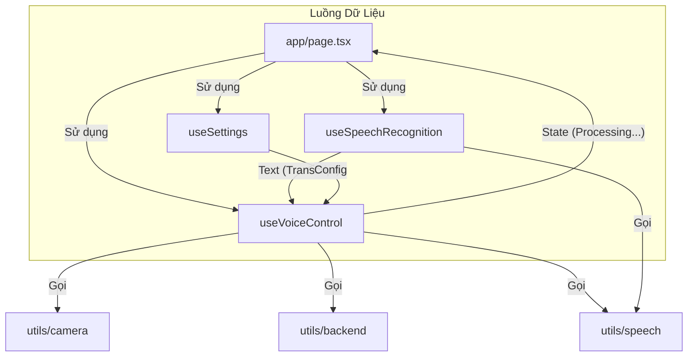

# 🏗️ Kiến trúc & Logic Hệ thống VoiceControl Cam

Tài liệu này mô tả chi tiết luồng xử lý (logic flow) và mối quan hệ giữa các thành phần (files) chính trong dự án.

## 1. Tổng quan các file chính

### 📱 UI & Entry Point
- **`src/app/page.tsx`**:
  - Là "nhạc trưởng" (orchestrator) kết nối mọi thứ.
  - Khởi tạo các hooks chính (`useSettings`, `useVoiceControl`, `useSpeechRecognition`).
  - Render UI chính: nút Micro (`VoiceControlButton`), trạng thái (`StatusDisplay`), và panel cài đặt (`SettingsPanel`).

### 🧠 Hooks (Logic cốt lõi)
- **`src/hooks/useVoiceControl.ts`**:
  - Quản lý **nghiệp vụ** (business logic) của toàn app.
  - Xử lý trạng thái cao cấp: `waitingForTrigger` (chờ "bạn ơi") vs `waitingForRequest` (chờ lệnh).
  - Điều phối luồng: Nhận lệnh → Chụp ảnh → Gửi Backend → Nhận kết quả → Đọc TTS.
- **`src/hooks/useSpeechRecognition.ts`**:
  - Quản lý **kỹ thuật** nhận diện giọng nói (Web Speech API Wrapper).
  - Xử lý các sự kiện `onstart`, `onend`, `onresult`, `onerror`.
  - Logic **Trigger Word Detection** ("bạn ơi") nằm ở đây để phản hồi nhanh nhất.
  - Xử lý retry/restart khi bị ngắt.
- **`src/hooks/useSettings.ts`**:
  - Quản lý cấu hình (backend URL, voice speed, camera mode...).
  - Sync với Supabase và LocalStorage.

### 🛠️ Utils (Hàm hỗ trợ)
- **`src/utils/speech.ts`**:
  - Chứa logic normalize text (xử lý tiếng Việt, bỏ dấu).
  - **TTS Engine**: Wrapper cho `SpeechSynthesis` (browser) và Zalo TTS (fallback).
  - `unlockAudio()`: Hack để enable audio trên mobile browsers.
- **`src/utils/camera.ts`**:
  - Logic chụp ảnh từ Camera thiết bị hoặc lấy ảnh mẫu từ Supabase.
- **`src/utils/backend.ts`**:
  - Hàm `sendToBackend`: gửi ảnh + prompt lên server xử lý AI.

---

## 2. Biểu đồ mối quan hệ (Component/Hook Map)

---

## 3. Chi tiết Luồng hoạt động (Logic Flow)

### Giai đoạn 1: Khởi động & Chờ lệnh ("Idle / Waiting for Trigger")
1.  **User** bấm nút Micro.
2.  `useSpeechRecognition` gọi `unlockAudio()` (để "mồi" audio context cho mobile).
3.  `SpeechRecognition` bắt đầu nghe (`continuous: true`).
4.  **Trạng thái**: `waitingForTrigger = true`.
5.  **Logic**:
    -   Hàm `onresult` liên tục nhận transcript.
    -   Kiểm tra `containsTriggerWord(transcript)` (check "bạn ơi", "ba ơi", v.v.).
    -   Nếu **CÓ**:
        -   Chuyển sang Giai đoạn 2.
        -   Phát TTS: "Bạn cần giúp gì?".

### Giai đoạn 2: Nhận lệnh ("Listening for Request")
1.  **Trạng thái**: `waitingForTrigger = false`, `waitingForRequest = true`.
2.  **Logic**:
    -   Bộ đếm ngược (Timeout 7-8s) được kích hoạt. Nếu im lặng quá lâu -> Quay về Giai đoạn 1.
    -   `onresult` chờ một câu lệnh hoàn chỉnh ("final result").
    -   **De-duplication**: Kiểm tra nếu câu lệnh trùng với câu vừa nói cách đây < 1s thì bỏ qua (tránh lỗi lặp của Chrome).
    -   Nếu nhận được lệnh (ví dụ: "Cái này là gì?"):
        -   Gọi `onUserRequest`.
        -   Chuyển sang Giai đoạn 3.

### Giai đoạn 3: Xử lý ("Processing")
1.  **Trạng thái**: `isProcessing = true`. `SpeechRecognition` **TẠM DỪNG** (để tránh nhiễu mic khi loa đang đọc).
2.  `useVoiceControl` điều phối:
    -   **Chụp ảnh**: Gọi `utils/camera`.
    -   **Gửi Backend**: Gọi `utils/backend` (gửi ảnh + text).
    -   Nhận phản hồi JSON `{ text: "Đây là quả táo..." }`.

### Giai đoạn 4: Phản hồi & Reset ("Speaking & Reset")
1.  **Phát loa**:
    -   Gọi `speakResult` trong `utils/speech`.
    -   Hệ thống ưu tiên: Dùng giọng chị Google (Browser TTS). Nếu lỗi hoặc không có tiếng Việt -> Fallback sang Zalo TTS API.
2.  **Kết thúc**:
    -   Khi loa đọc xong (`onend`).
    -   Chờ 300ms (để tránh micro thu lại tiếng vọng cuối cùng của loa).
    -   **Tự động Restart** `SpeechRecognition`.
    -   Quay về **Giai đoạn 1** (Chờ "bạn ơi").

---

## 4. Các điểm lưu ý đặc biệt (Technical Highlights)

1.  **Mobile Compatibility**:
    -   **Audio Unlock**: Mọi tương tác chạm (click) đều gọi `unlockAudio()` phát 1 buffer âm thanh rỗng. Điều này cho phép app tự động đọc TTS sau này mà không bị chặn bởi chính sách Autoplay của iOS/Android.
    -   **No `getUserMedia`**: Không gọi hàm này thủ công. Để `SpeechRecognition` tự quản lý quyền Mic, tránh xung đột trên Android.

2.  **Anti-Echo (Chống vọng)**:
    -   Logic: Sau khi loa vừa tắt, trong 1s đầu tiên, mọi input giọng nói sẽ bị bỏ qua (`now - lastTTSEndTime < 1000`). Tránh việc App tự nghe thấy chính mình ("Bạn cần giúp gì?") và loop vô tận.

3.  **Zalo TTS Fallback**:
    -   Một số trình duyệt mobile (Firefox Android, web view lạ) không có giọng tiếng Việt native.
    -   Hệ thống tự detect `getVoices()`, nếu thiếu `vi-VN` sẽ chuyển sang gọi API Zalo TTS và phát qua thẻ `<audio>`.
