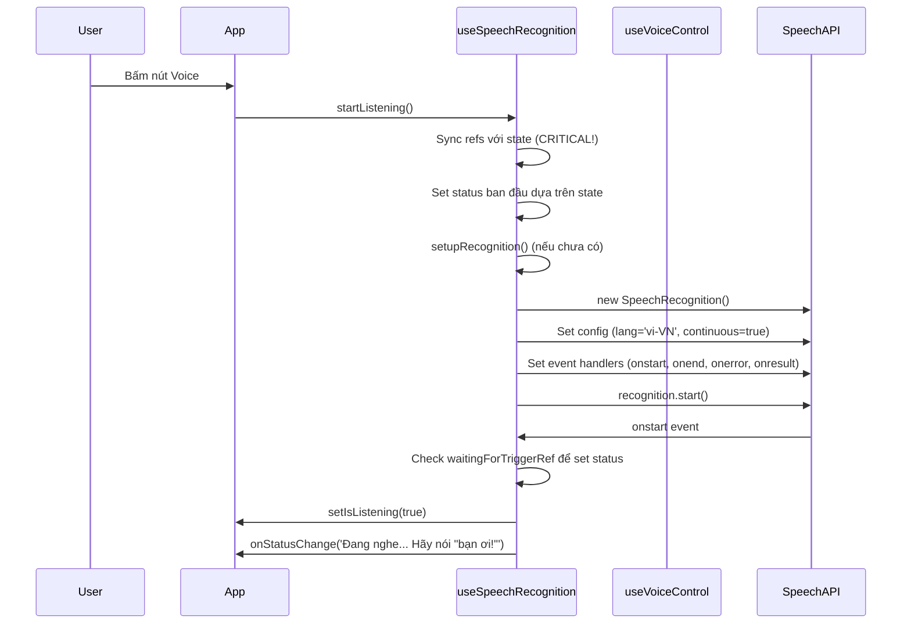
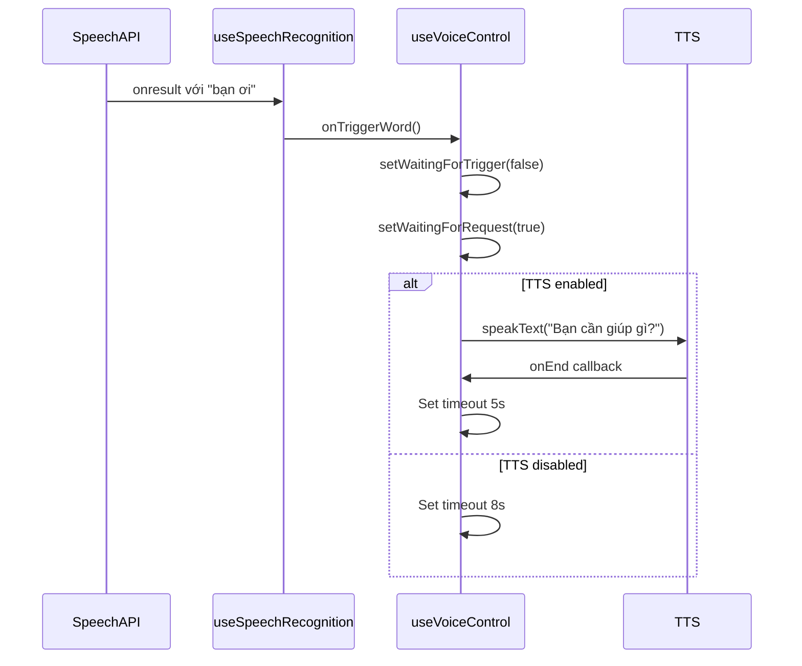
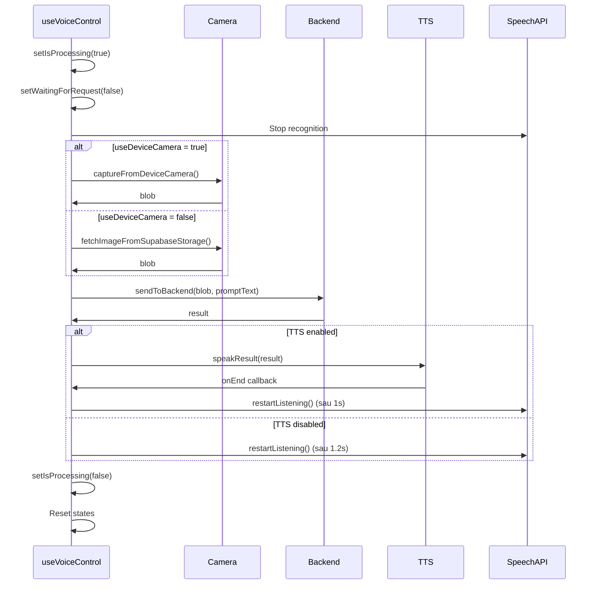

# Tài Liệu Chi Tiết: Xử Lý Nhận Diện Giọng Nói và Luồng Xử Lý

## Mục Lục

1. [Tổng Quan](#tổng-quan)
2. [Kiến Trúc Hệ Thống](#kiến-trúc-hệ-thống)
3. [Luồng Xử Lý Chi Tiết](#luồng-xử-lý-chi-tiết)
4. [Các State và Refs](#các-state-và-refs)
5. [Xử Lý Trigger Word](#xử-lý-trigger-word)
6. [Xử Lý User Request](#xử-lý-user-request)
7. [Auto-Restart Logic](#auto-restart-logic)
8. [Error Handling](#error-handling)
9. [Edge Cases](#edge-cases)

---

## Tổng Quan

Hệ thống nhận diện giọng nói sử dụng **Web Speech Recognition API** để nhận diện giọng nói tiếng Việt, với cơ chế trigger word ("bạn ơi") để kích hoạt và xử lý các yêu cầu của người dùng.

### Tính Năng Chính

- ✅ Nhận diện giọng nói liên tục (continuous recognition)
- ✅ Kích hoạt bằng trigger word "bạn ơi"
- ✅ Xử lý yêu cầu người dùng với AI backend
- ✅ Tự động restart sau khi xử lý xong
- ✅ Tránh feedback loop giữa microphone và speaker
- ✅ Timeout tự động reset về trạng thái chờ trigger

---

## Kiến Trúc Hệ Thống

### Các Component Chính

```
┌─────────────────────────────────────────────────────────────┐
│                    VoiceControlApp (page.tsx)                │
│  - Quản lý UI và orchestration                              │
│  - Kết nối các hooks                                         │
└────────────────────┬────────────────────────────────────────┘
                     │
        ┌────────────┴────────────┐
        │                         │
┌───────▼──────────┐    ┌─────────▼──────────┐
│ useSpeechRecognition│  │  useVoiceControl   │
│                    │  │                    │
│ - Setup API        │  │ - State management │
│ - Event handlers   │  │ - Request handling │
│ - Auto-restart     │  │ - Trigger handling │
└────────────────────┘  └────────────────────┘
        │                         │
        └────────────┬────────────┘
                     │
        ┌────────────▼──────────┐
        │   Speech Recognition   │
        │        API             │
        └────────────────────────┘
```

### File Structure

```
src/
├── app/
│   └── page.tsx                    # Main component
├── hooks/
│   ├── useSpeechRecognition.ts     # Speech recognition logic
│   └── useVoiceControl.ts           # Voice control state & handlers
├── utils/
│   ├── speech.ts                   # TTS & text normalization
│   └── speech-cloud.ts             # Cloud TTS (Zalo)
└── types/
    └── speech-recognition.d.ts     # TypeScript definitions
```

---

## Luồng Xử Lý Chi Tiết

### 1. Khởi Tạo (Initialization)



**Chi Tiết:**

1. **User bấm nút Voice**

   - `page.tsx` gọi `startListening()` từ `useSpeechRecognition`
   - Hook nhận props: `isProcessing`, `waitingForTrigger`, `waitingForRequest`

2. **Sync Refs (QUAN TRỌNG!)**

   ```typescript
   // Sync refs TRƯỚC khi start để đảm bảo callbacks có giá trị mới nhất
   waitingForTriggerRef.current = waitingForTrigger;
   waitingForRequestRef.current = waitingForRequest;
   isProcessingRef.current = isProcessing;
   ```

   - **Tại sao quan trọng:** Callbacks (`onstart`, `onresult`, `onend`) được tạo trong `setupRecognition` và có closure. Nếu không sync refs trước, callbacks sẽ dùng giá trị cũ.

3. **Set Status Ban Đầu**

   ```typescript
   // Set status dựa trên trạng thái hiện tại TRƯỚC khi start
   if (waitingForTriggerRef.current) {
     onStatusChange('Đang khởi động... Hãy nói "bạn ơi!" để bắt đầu');
   } else if (waitingForRequestRef.current) {
     onStatusChange("Đang khởi động... Hãy nói yêu cầu của bạn");
   } else {
     onStatusChange("Đang khởi động...");
   }
   ```

   - Đảm bảo user thấy status đúng ngay từ đầu

4. **Setup Recognition (nếu chưa có)**

   ```typescript
   recognitionRef.current = new SpeechRecognition();
   recognitionRef.current.lang = "vi-VN";
   recognitionRef.current.continuous = true; // Nghe liên tục
   recognitionRef.current.interimResults = true; // Nhận kết quả tạm thời

   // Setup event handlers
   recognitionRef.current.onstart = () => { ... };
   recognitionRef.current.onend = () => { ... };
   recognitionRef.current.onerror = () => { ... };
   recognitionRef.current.onresult = () => { ... };
   ```

5. **Start Recognition**
   - Speech Recognition API tự động request microphone permission khi `start()`
   - Khi start thành công → trigger `onstart` event
   - Trong `onstart`, lại check `waitingForTriggerRef` để set status chính xác

### 2. Trạng Thái Chờ Trigger Word

**State:**

- `waitingForTrigger = true`
- `waitingForRequest = false`
- `isProcessing = false`

**Luồng:**

```
Speech API nhận diện → onresult event
    ↓
Kiểm tra: isProcessing? → NO
    ↓
Kiểm tra: waitingForTrigger? → YES
    ↓
Normalize text và kiểm tra trigger word
    ↓
Có "bạn ơi"?
    ├─ YES → onTriggerWord() → Chuyển sang chờ request
    └─ NO  → Hiển thị "Nghe được: ... (chờ 'bạn ơi!')"
```

**Code Logic:**

```typescript
// Chỉ xử lý nếu có text thực sự (không phải empty/whitespace)
const text = finalTranscript || interimTranscript;
const trimmedText = text ? text.trim() : "";

if (trimmedText) {
  // Kiểm tra đang xử lý hoặc TTS đang chạy
  if (isProcessingRef.current || isSpeaking()) {
    return; // Bỏ qua
  }

  // Kiểm tra trigger word
  if (waitingForTriggerRef.current) {
    if (containsTriggerWord(trimmedText)) {
      onTriggerWord(); // Chuyển sang chờ request
      return;
    }
    onStatusChange("Nghe được: " + trimmedText + ' (chờ "bạn ơi!")');
    return;
  }
}
```

**Lưu ý quan trọng:**

- Chỉ xử lý khi `trimmedText` không rỗng
- Dùng `isProcessingRef.current` thay vì `isProcessing` để tránh closure issue
- Dùng `waitingForTriggerRef.current` để có giá trị mới nhất

**Trigger Word Detection:**

- Normalize text: lowercase, remove diacritics, remove special chars
- Kiểm tra: `normalized.includes('ban oi')` hoặc `normalized.includes('ban ơi')`

### 3. Xử Lý Trigger Word

**Khi phát hiện "bạn ơi":**



**Chi Tiết:**

1. **State Changes:**

   ```typescript
   setWaitingForTrigger(false); // Không còn chờ trigger
   setWaitingForRequest(true); // Bắt đầu chờ request
   ```

2. **TTS Response (nếu enabled):**

   - Nói: "Bạn cần giúp gì?"
   - Sau khi TTS kết thúc → set `waitingForRequest = true`

3. **Timeout:**
   - Nếu có TTS: 5 giây
   - Nếu không có TTS: 8 giây
   - Sau timeout → Reset về chờ trigger word

### 4. Trạng Thái Chờ User Request

**State:**

- `waitingForTrigger = false`
- `waitingForRequest = true`
- `isProcessing = false`

**Luồng:**

```
Speech API nhận diện → onresult event
    ↓
Kiểm tra: isProcessing? → NO
    ↓
Kiểm tra: waitingForTrigger? → NO
    ↓
Kiểm tra: waitingForRequest? → YES
    ↓
Kiểm tra: finalTranscript có >= 2 từ?
    ├─ NO  → Hiển thị interim transcript
    └─ YES → Xử lý request
        ↓
    Kiểm tra: Có trigger word trong request?
    ├─ YES → Bỏ qua, nhắc không cần nói "bạn ơi"
    └─ NO  → Kiểm tra timing
        ↓
    Kiểm tra: Quá sớm sau TTS? (< 4s)
    ├─ YES → Bỏ qua để tránh feedback
    └─ NO  → Kiểm tra rate limiting
        ↓
    Kiểm tra: Quá sớm sau request trước? (< 2s)
    ├─ YES → Bỏ qua
    └─ NO  → onUserRequest(finalTranscript)
```

**Code Logic:**

```typescript
// Chỉ xử lý nếu có text thực sự
const text = finalTranscript || interimTranscript;
const trimmedText = text ? text.trim() : "";

if (trimmedText) {
  // Kiểm tra đang xử lý hoặc TTS đang chạy
  if (isProcessingRef.current || isSpeaking()) {
    return; // Bỏ qua
  }

  // Nếu đã kích hoạt và đang đợi request
  if (!waitingForTriggerRef.current && waitingForRequestRef.current) {
    // Kiểm tra có final transcript đủ dài (>= 2 từ)
    if (
      finalTranscript.trim() &&
      finalTranscript.trim().split(" ").length >= 2
    ) {
      const now = Date.now();

      // Kiểm tra không phải trigger word
      if (containsTriggerWord(finalTranscript.trim())) {
        onStatusChange('Vui lòng nói yêu cầu, không cần nói "bạn ơi!" nữa');
        return;
      }

      // Kiểm tra timing để tránh feedback (tối thiểu 4s sau TTS)
      if (now - lastTTSEndTimeRef.current < 4000) {
        onStatusChange("Đang đợi sau khi đọc xong...");
        return;
      }

      // Rate limiting: tối thiểu 2 giây giữa các request
      if (now - lastCaptureTimeRef.current > 2000) {
        lastCaptureTimeRef.current = now;
        onUserRequest(finalTranscript.trim());
      } else {
        console.log("Too soon since last request, ignoring");
      }
    } else {
      // Hiển thị interim transcript hoặc final transcript chưa đủ dài
      onStatusChange("Nghe được: " + trimmedText);
    }
  } else if (!waitingForTriggerRef.current && !waitingForRequestRef.current) {
    // Trường hợp không mong đợi: không chờ trigger và không chờ request
    // Thường xảy ra khi đang trong quá trình chuyển đổi state
    // Không set status để tránh hiển thị sai
    console.log(
      "Unexpected state: not waiting for trigger and not waiting for request"
    );
  }
} else {
  // Không có text, không làm gì cả
  console.log("No text in result (empty or whitespace only)");
}
```

**Cải tiến:**

- Chỉ xử lý khi có `trimmedText` thực sự
- Xử lý trường hợp không mong đợi một cách an toàn
- Không set status khi không chắc chắn về state

### 5. Xử Lý User Request

**Luồng Xử Lý Request:**



**Chi Tiết:**

1. **Stop Recognition:**

   ```typescript
   setIsProcessing(true);
   setWaitingForRequest(false);
   if (recognitionRef.current) {
     recognitionRef.current.stop();
   }
   ```

2. **Capture Image:**

   - Nếu `useDeviceCamera = true`: Chụp từ thiết bị
   - Nếu `useDeviceCamera = false`: Lấy từ Supabase storage

3. **Send to Backend:**

   - Gửi ảnh + prompt text đến backend
   - Nhận kết quả từ AI

4. **TTS Response:**

   - Nếu `settings.speak = true`: Đọc kết quả
   - Set `lastTTSEndTimeRef.current = Date.now()` để track timing

5. **Restart Recognition:**
   - Sau khi TTS kết thúc hoặc không có TTS
   - Delay 1-1.2 giây để tránh feedback
   - Reset về trạng thái chờ trigger word

### 6. Auto-Restart Logic

**Khi nào tự động restart:**

1. **Sau khi recognition kết thúc (`onend`):**

   ```typescript
   if (
     shouldAutoListenRef.current &&
     recognitionRef.current &&
     !isProcessingRef.current &&
     !isSpeaking()
   ) {
     setTimeout(() => {
       recognitionRef.current.start();
     }, 1500);
   }
   ```

2. **Sau khi xử lý request xong:**

   - Trong `handleUserRequest` → sau TTS hoặc sau error handling

3. **Manual restart:**
   - `restartListening()` được gọi từ `useVoiceControl`

**Điều Kiện Restart:**

- ✅ `shouldAutoListenRef.current = true`
- ✅ `recognitionRef.current` tồn tại
- ✅ `!isProcessingRef.current` (không đang xử lý)
- ✅ `!isSpeaking()` (TTS không đang chạy)

**Delay:**

- Auto-restart sau `onend`: 1500ms
- Restart sau TTS: 1000ms
- Restart sau error: 2000ms

---

## Các State và Refs

### State trong `useVoiceControl`

| State               | Type      | Mô Tả                 | Giá Trị Mặc Định |
| ------------------- | --------- | --------------------- | ---------------- |
| `isProcessing`      | `boolean` | Đang xử lý request    | `false`          |
| `waitingForTrigger` | `boolean` | Đang chờ trigger word | `true`           |
| `waitingForRequest` | `boolean` | Đang chờ user request | `false`          |
| `currentRequest`    | `string`  | Request hiện tại      | `''`             |

### Refs trong `useSpeechRecognition`

| Ref                    | Type                           | Mô Tả                               |
| ---------------------- | ------------------------------ | ----------------------------------- |
| `recognitionRef`       | `RefObject<SpeechRecognition>` | Instance của Speech Recognition API |
| `shouldAutoListenRef`  | `MutableRefObject<boolean>`    | Flag để auto-restart                |
| `waitingForTriggerRef` | `MutableRefObject<boolean>`    | Sync với `waitingForTrigger` state  |
| `waitingForRequestRef` | `MutableRefObject<boolean>`    | Sync với `waitingForRequest` state  |
| `isProcessingRef`      | `MutableRefObject<boolean>`    | Sync với `isProcessing` state       |
| `lastCaptureTimeRef`   | `MutableRefObject<number>`     | Timestamp của request cuối cùng     |
| `lastTTSEndTimeRef`    | `MutableRefObject<number>`     | Timestamp khi TTS kết thúc          |

### Tại Sao Dùng Refs?

**Vấn Đề Closure:**

- Callbacks (`onresult`, `onend`, `onstart`, `onerror`) được tạo trong `setupRecognition`
- `setupRecognition` được wrap trong `useCallback` với dependencies hạn chế
- Nếu dùng state trực tiếp → closure sẽ capture giá trị cũ tại thời điểm tạo callback
- Refs luôn có giá trị mới nhất → giải quyết closure issue

**Ví Dụ:**

```typescript
// ❌ SAI: Closure capture giá trị cũ
const setupRecognition = useCallback(() => {
  recognitionRef.current.onresult = () => {
    if (isProcessing) {
      // Giá trị cũ tại thời điểm setupRecognition được tạo!
      // Nếu isProcessing thay đổi sau đó, callback vẫn dùng giá trị cũ
      return;
    }
  };
}, [onStatusChange]); // isProcessing không trong dependencies

// ✅ ĐÚNG: Dùng ref để có giá trị mới nhất
const setupRecognition = useCallback(() => {
  recognitionRef.current.onresult = () => {
    if (isProcessingRef.current) {
      // Giá trị mới nhất! Luôn được sync trước khi dùng
      return;
    }
  };
}, [onStatusChange]);

// Sync ref mỗi lần render
isProcessingRef.current = isProcessing;
```

**Khi Nào Sync Refs:**

1. **Mỗi lần render:** Trong component body (không trong callback)
2. **Trước khi start:** Trong `startListening()` để đảm bảo có giá trị mới nhất
3. **Trong callbacks:** Luôn dùng refs, không dùng state trực tiếp

---

## Xử Lý Trigger Word

### Normalization

**Mục đích:** Chuẩn hóa text để nhận diện trigger word chính xác hơn

```typescript
export const normalizeVN = (str: string): string => {
  return (str || "")
    .toLowerCase()
    .normalize("NFD")
    .replace(/\p{Diacritic}/gu, "") // Bỏ dấu: "bạn ơi" → "ban oi"
    .replace(/[^a-z0-9\s]/g, " ") // Bỏ ký tự đặc biệt
    .replace(/\s+/g, " ")
    .trim(); // Chuẩn hóa khoảng trắng
};
```

**Ví Dụ:**

- "Bạn ơi!" → "ban oi"
- "BẠN ƠI" → "ban oi"
- "Bạn... ơi?" → "ban oi"

### Detection Logic

```typescript
export const containsTriggerWord = (text: string): boolean => {
  const normalized = normalizeVN(text);
  return normalized.includes("ban oi") || normalized.includes("ban ơi");
};
```

**Các Trường Hợp:**

- ✅ "bạn ơi" → detected
- ✅ "Bạn ơi!" → detected
- ✅ "Xin chào bạn ơi" → detected
- ✅ "Bạn ơi, giúp tôi" → detected
- ❌ "bạn" → not detected
- ❌ "ơi" → not detected

---

## Xử Lý User Request

### Validation

**Điều Kiện Xử Lý Request:**

1. **Độ dài tối thiểu:**

   ```typescript
   finalTranscript.trim().split(" ").length >= 2;
   ```

   - Phải có ít nhất 2 từ
   - Tránh xử lý các từ đơn lẻ

2. **Không chứa trigger word:**

   ```typescript
   if (containsTriggerWord(finalTranscript.trim())) {
     // Bỏ qua, nhắc người dùng
   }
   ```

3. **Timing Checks:**
   - **Sau TTS:** Tối thiểu 4 giây để tránh feedback
   - **Rate limiting:** Tối thiểu 2 giây giữa các request

### Request Flow

```
User nói request
    ↓
Speech API nhận diện
    ↓
onresult event
    ↓
Validation checks
    ├─ < 2 từ → Hiển thị interim transcript
    ├─ Có trigger word → Nhắc không cần "bạn ơi"
    ├─ Quá sớm sau TTS → Đợi thêm
    ├─ Quá sớm sau request trước → Bỏ qua
    └─ ✅ Valid → onUserRequest()
        ↓
handleUserRequest()
    ↓
Stop recognition
    ↓
Capture image
    ↓
Send to backend
    ↓
Get result
    ↓
TTS (nếu enabled)
    ↓
Restart recognition
```

---

## Auto-Restart Logic

### Các Trường Hợp Restart

#### 1. Auto-Restart sau `onend`

**Khi nào:** Speech Recognition tự động kết thúc (timeout, no speech, etc.)

**Điều kiện:**

```typescript
shouldAutoListenRef.current && // Được phép auto-restart
  recognitionRef.current && // Recognition instance tồn tại
  !isProcessingRef.current && // Không đang xử lý
  !isSpeaking(); // TTS không đang chạy
```

**Delay:** 1500ms để tránh restart quá nhanh

#### 2. Restart sau TTS

**Khi nào:** Sau khi TTS kết thúc đọc kết quả

**Flow:**

```typescript
speakResult(result, settings, onStart, onEnd, ...);
// onEnd callback:
setTimeout(() => {
  restartListening();
}, 1000);
```

**Delay:** 1000ms

#### 3. Restart sau error handling

**Khi nào:** Sau khi xử lý request xong (có lỗi hoặc không)

**Delay:** 2000ms (lâu hơn để đảm bảo cleanup hoàn tất)

### Tránh Feedback Loop

**Vấn đề:** Microphone có thể ghi nhận âm thanh từ speaker → tạo feedback loop

**Giải pháp:**

1. **Stop recognition khi TTS bắt đầu:**

   ```typescript
   if (recognitionRef?.current) {
     recognitionRef.current.stop();
   }
   ```

2. **Delay sau TTS:**

   ```typescript
   if (now - lastTTSEndTimeRef.current < 4000) {
     // Bỏ qua request để tránh feedback
   }
   ```

3. **Delay khi restart:**
   - Đợi 1-1.5 giây sau khi TTS kết thúc mới restart

---

## Error Handling

### Speech Recognition Errors

| Error Code      | Mô Tả                           | Xử Lý                            |
| --------------- | ------------------------------- | -------------------------------- |
| `no-speech`     | Không nghe thấy giọng nói       | Hiển thị status, auto-restart    |
| `not-allowed`   | Không được phép dùng microphone | Hiển thị lỗi, yêu cầu permission |
| `aborted`       | Bị hủy                          | Bỏ qua, có thể restart           |
| `network`       | Lỗi mạng                        | Hiển thị lỗi                     |
| `audio-capture` | Không capture được audio        | Hiển thị lỗi                     |

**Code:**

```typescript
recognitionRef.current.onerror = (event: SpeechRecognitionErrorEvent) => {
  if (event.error === "no-speech") {
    onStatusChange("Không nghe thấy giọng nói");
  } else if (event.error === "not-allowed") {
    onStatusChange("Vui lòng cho phép sử dụng microphone");
  } else {
    onStatusChange("Lỗi: " + event.error);
  }
};
```

### Start Listening Errors

**Các lỗi khi start:**

1. **NotAllowedError:**

   - User từ chối microphone permission
   - Xử lý: Hiển thị message, throw error

2. **NotFoundError:**

   - Không tìm thấy microphone
   - Xử lý: Hiển thị message, throw error

3. **Already started:**
   - Recognition đã được start rồi
   - Xử lý: Bỏ qua, không làm gì

**Code:**

```typescript
catch (err: any) {
  if (err.name === 'NotAllowedError' || err.error === 'not-allowed') {
    onStatusChange('Vui lòng cho phép sử dụng microphone');
    throw new Error('Vui lòng cho phép sử dụng microphone');
  } else if (err.name === 'NotFoundError' || err.error === 'no-speech') {
    onStatusChange('Không tìm thấy microphone');
    throw new Error('Không tìm thấy microphone');
  } else if (err.message && err.message.includes('already started')) {
    console.log('Recognition already started, ignoring');
    return;
  }
}
```

### Request Processing Errors

**Các lỗi khi xử lý request:**

1. **Camera error:**

   - Không chụp được ảnh
   - Xử lý: Hiển thị error, reset state

2. **Backend error:**

   - Không gửi được đến backend
   - Xử lý: Hiển thị error, reset state

3. **TTS error:**
   - Không đọc được kết quả
   - Xử lý: Vẫn restart recognition

**Code:**

```typescript
catch (err: unknown) {
  console.error('Error in handleUserRequest:', err);
  showNotification('Lỗi xử lý: ' + (err instanceof Error ? err.message : 'Unknown error'), 'error');
  setStatus('Lỗi xử lý: ' + (err instanceof Error ? err.message : 'Unknown error'));
} finally {
  setIsProcessing(false);
  setWaitingForTrigger(true);
  setWaitingForRequest(false);
  // Restart recognition nếu không có TTS
}
```

---

## Edge Cases

### 1. Recognition tự động kết thúc

**Vấn đề:** Speech Recognition API có thể tự động kết thúc sau một khoảng thời gian không có speech

**Giải pháp:** Auto-restart trong `onend` handler

```typescript
recognitionRef.current.onend = () => {
  if (
    shouldAutoListenRef.current &&
    !isProcessingRef.current &&
    !isSpeaking()
  ) {
    setTimeout(() => {
      recognitionRef.current.start();
    }, 1500);
  }
};
```

### 2. User nói trigger word trong request

**Vấn đề:** User có thể nói "bạn ơi" trong request

**Giải pháp:** Kiểm tra và bỏ qua

```typescript
if (containsTriggerWord(finalTranscript.trim())) {
  onStatusChange('Vui lòng nói yêu cầu, không cần nói "bạn ơi!" nữa');
  return;
}
```

### 3. Request quá sớm sau TTS

**Vấn đề:** Microphone có thể ghi nhận âm thanh từ speaker

**Giải pháp:** Delay 4 giây sau TTS

```typescript
if (now - lastTTSEndTimeRef.current < 4000) {
  onStatusChange("Đang đợi sau khi đọc xong...");
  return;
}
```

### 4. Multiple rapid requests

**Vấn đề:** User có thể nói nhiều request liên tiếp quá nhanh

**Giải pháp:** Rate limiting 2 giây

```typescript
if (now - lastCaptureTimeRef.current > 2000) {
  lastCaptureTimeRef.current = now;
  onUserRequest(finalTranscript.trim());
} else {
  console.log("Too soon since last request, ignoring");
}
```

### 5. Timeout khi chờ request

**Vấn đề:** User không nói request sau khi trigger

**Giải pháp:** Timeout tự động reset

```typescript
timeoutRef.current = setTimeout(() => {
  setWaitingForTrigger(true);
  setWaitingForRequest(false);
  setStatus('Hãy nói "bạn ơi!" để bắt đầu...');
}, 5000); // 5s nếu có TTS, 8s nếu không có TTS
```

### 6. Recognition đã được start

**Vấn đề:** Gọi `start()` khi đã start rồi → error

**Giải pháp:** Catch và ignore

```typescript
try {
  recognitionRef.current.start();
} catch (err) {
  if (err.message && err.message.includes("already started")) {
    console.log("Recognition already started, ignoring");
    return;
  }
}
```

### 7. State không sync với refs

**Vấn đề:** Callbacks dùng giá trị state cũ do closure

**Giải pháp:** Dùng refs và sync thường xuyên

```typescript
// ✅ Sync refs mỗi lần render (trong component body)
waitingForTriggerRef.current = waitingForTrigger;
waitingForRequestRef.current = waitingForRequest;
isProcessingRef.current = isProcessing;

// ✅ Sync refs TRƯỚC khi start listening
const startListening = useCallback(async () => {
  // Sync refs trước khi start
  waitingForTriggerRef.current = waitingForTrigger;
  waitingForRequestRef.current = waitingForRequest;
  isProcessingRef.current = isProcessing;

  // ... rest of code
}, [setupRecognition, waitingForTrigger, waitingForRequest, isProcessing]);

// ✅ Dùng refs trong callbacks
recognitionRef.current.onresult = () => {
  if (isProcessingRef.current) { ... } // Dùng ref, không dùng state
};
```

**Lưu ý:** Phải sync refs TRƯỚC khi start để đảm bảo callbacks có giá trị mới nhất ngay từ đầu.

---

## Best Practices

### 1. Luôn sync refs trước khi dùng

```typescript
// ✅ ĐÚNG: Sync refs trong component body
waitingForTriggerRef.current = waitingForTrigger;
waitingForRequestRef.current = waitingForRequest;
isProcessingRef.current = isProcessing;

// ✅ ĐÚNG: Sync refs TRƯỚC khi start
const startListening = useCallback(async () => {
  // Sync refs trước
  waitingForTriggerRef.current = waitingForTrigger;
  // ... sau đó mới start
  recognitionRef.current.start();
}, [waitingForTrigger]);

// ✅ ĐÚNG: Dùng refs trong callbacks
recognitionRef.current.onresult = () => {
  if (waitingForTriggerRef.current) { ... }
};

// ❌ SAI: Dùng state trực tiếp trong callbacks
recognitionRef.current.onresult = () => {
  if (waitingForTrigger) { ... }  // Closure issue! Giá trị cũ!
};
```

### 2. Kiểm tra điều kiện trước khi restart

```typescript
// ✅ ĐÚNG
if (
  shouldAutoListenRef.current &&
  recognitionRef.current &&
  !isProcessingRef.current &&
  !isSpeaking()
) {
  recognitionRef.current.start();
}

// ❌ SAI
recognitionRef.current.start(); // Có thể gây lỗi!
```

### 3. Delay khi restart để tránh feedback

```typescript
// ✅ ĐÚNG
setTimeout(() => {
  recognitionRef.current.start();
}, 1500);

// ❌ SAI
recognitionRef.current.start(); // Quá nhanh, có thể feedback!
```

### 4. Stop recognition khi TTS bắt đầu

```typescript
// ✅ ĐÚNG
if (recognitionRef.current) {
  recognitionRef.current.stop();
}
speechSynthesis.speak(utterance);

// ❌ SAI
speechSynthesis.speak(utterance); // Có thể ghi nhận âm thanh!
```

### 5. Validate request trước khi xử lý

```typescript
// ✅ ĐÚNG
if (
  finalTranscript.trim() &&
  finalTranscript.trim().split(" ").length >= 2 &&
  !containsTriggerWord(finalTranscript.trim()) &&
  now - lastTTSEndTimeRef.current >= 4000 &&
  now - lastCaptureTimeRef.current > 2000
) {
  onUserRequest(finalTranscript.trim());
}

// ❌ SAI
onUserRequest(finalTranscript.trim()); // Không validate!
```

---

## Debugging Tips

### Console Logs

Hệ thống có nhiều console logs để debug:

- `=== START LISTENING DEBUG ===`
- `=== ONRESULT DEBUG ===`
- `=== PROCESSING USER REQUEST ===`
- `=== HANDLE TRIGGER WORD DEBUG ===`

### Kiểm Tra State

```typescript
console.log("waitingForTrigger:", waitingForTriggerRef.current);
console.log("waitingForRequest:", waitingForRequestRef.current);
console.log("isProcessing:", isProcessingRef.current);
console.log("shouldAutoListen:", shouldAutoListenRef.current);
```

### Kiểm Tra Timing

```typescript
console.log("Time since last TTS:", Date.now() - lastTTSEndTimeRef.current);
console.log(
  "Time since last request:",
  Date.now() - lastCaptureTimeRef.current
);
```

### Kiểm Tra Recognition State

```typescript
console.log("Recognition state:", {
  exists: !!recognitionRef.current,
  isListening: isListening,
  shouldAutoListen: shouldAutoListenRef.current,
});
```

---

## Tóm Tắt

### Luồng Chính

1. **Start** → Setup recognition → Start listening
2. **Chờ trigger** → Nhận diện "bạn ơi" → Chuyển sang chờ request
3. **Chờ request** → Nhận diện request → Xử lý
4. **Xử lý** → Stop recognition → Capture image → Send backend → TTS
5. **Restart** → Reset state → Restart recognition → Quay lại bước 2

### Key Points

- ✅ Dùng refs để tránh closure issues
- ✅ Auto-restart với điều kiện kiểm tra đầy đủ
- ✅ Delay để tránh feedback loop
- ✅ Validation request trước khi xử lý
- ✅ Timeout để reset state
- ✅ Error handling đầy đủ

---

---

## Troubleshooting Guide

### Vấn Đề: Recognition không start

**Triệu chứng:** Bấm nút nhưng không thấy "Đang nghe..."

**Kiểm tra:**

1. Mở Console và xem log `=== START LISTENING DEBUG ===`
2. Kiểm tra `recognitionRef.current` có tồn tại không
3. Kiểm tra có lỗi permission không

**Giải pháp:**

- Nếu `recognitionRef.current` là `null` → `setupRecognition()` chưa được gọi
- Nếu có lỗi `not-allowed` → User chưa cho phép microphone
- Nếu có lỗi `already started` → Recognition đã start rồi, bỏ qua

### Vấn Đề: Hiển thị "Đang xử lý, không nghe thêm..." ngay khi start

**Triệu chứng:** Bấm nút → Status hiển thị "Đang xử lý, không nghe thêm..."

**Nguyên nhân:**

- Refs chưa được sync đúng
- `waitingForTriggerRef.current` và `waitingForRequestRef.current` đều `false`

**Giải pháp:**

1. Kiểm tra trong `startListening()` có sync refs TRƯỚC khi start không:
   ```typescript
   waitingForTriggerRef.current = waitingForTrigger;
   waitingForRequestRef.current = waitingForRequest;
   ```
2. Kiểm tra trong `onresult` có check `trimmedText` không rỗng không
3. Kiểm tra `isProcessingRef.current` có đang `true` không

### Vấn Đề: Không nhận diện được trigger word "bạn ơi"

**Triệu chứng:** Nói "bạn ơi" nhưng không có phản hồi

**Kiểm tra:**

1. Mở Console và xem log `=== ONRESULT DEBUG ===`
2. Kiểm tra `normalizedText` có chứa "ban oi" không
3. Kiểm tra `waitingForTriggerRef.current` có `true` không

**Giải pháp:**

- Nếu `waitingForTriggerRef.current` là `false` → Đã qua giai đoạn chờ trigger
- Nếu `normalizedText` không có "ban oi" → Text normalization có vấn đề
- Thử nói rõ ràng hơn hoặc kiểm tra microphone

### Vấn Đề: Request không được xử lý

**Triệu chứng:** Nói request nhưng không có phản hồi

**Kiểm tra:**

1. Kiểm tra `waitingForRequestRef.current` có `true` không
2. Kiểm tra `finalTranscript` có >= 2 từ không
3. Kiểm tra timing: `now - lastTTSEndTimeRef.current >= 4000`
4. Kiểm tra rate limiting: `now - lastCaptureTimeRef.current > 2000`

**Giải pháp:**

- Nếu `waitingForRequestRef.current` là `false` → Chưa qua trigger word
- Nếu < 2 từ → Nói dài hơn
- Nếu quá sớm sau TTS → Đợi thêm vài giây
- Nếu quá sớm sau request trước → Đợi 2 giây

### Vấn Đề: Recognition tự động restart liên tục

**Triệu chứng:** Recognition start → end → start → end... liên tục

**Nguyên nhân:**

- `shouldAutoListenRef.current` là `true`
- `isProcessingRef.current` là `false`
- `isSpeaking()` là `false`
- Nhưng có điều kiện nào đó khiến recognition end ngay

**Giải pháp:**

1. Kiểm tra có lỗi trong `onerror` không
2. Kiểm tra có phải `no-speech` error không
3. Tăng delay trong auto-restart từ 1500ms lên 2000ms

### Vấn Đề: Feedback loop (microphone ghi nhận speaker)

**Triệu chứng:** Hệ thống tự động nhận diện lại những gì vừa nói

**Giải pháp:**

1. Đảm bảo stop recognition khi TTS bắt đầu:
   ```typescript
   if (recognitionRef.current) {
     recognitionRef.current.stop();
   }
   ```
2. Delay sau TTS: Tối thiểu 4 giây
3. Delay khi restart: Tối thiểu 1 giây sau TTS kết thúc

### Debug Checklist

Khi gặp vấn đề, kiểm tra theo thứ tự:

1. ✅ **Console Logs:** Mở Console và xem các log debug
2. ✅ **Refs Sync:** Kiểm tra refs có được sync đúng không
3. ✅ **State Values:** Kiểm tra state values có đúng không
4. ✅ **Timing:** Kiểm tra timing có đúng không (TTS delay, rate limiting)
5. ✅ **Error Events:** Kiểm tra có error events không
6. ✅ **Browser Support:** Kiểm tra browser có hỗ trợ Speech Recognition không
7. ✅ **Microphone Permission:** Kiểm tra microphone permission

---

## Quick Reference

### State Machine

```
[IDLE]
  ↓ (startListening)
[WAITING_FOR_TRIGGER] (waitingForTrigger=true, waitingForRequest=false)
  ↓ (detect "bạn ơi")
[WAITING_FOR_REQUEST] (waitingForTrigger=false, waitingForRequest=true)
  ↓ (detect request)
[PROCESSING] (isProcessing=true)
  ↓ (complete)
[WAITING_FOR_TRIGGER] (reset)
```

### Key Functions

| Function              | Mô Tả                 | Khi Nào Gọi           |
| --------------------- | --------------------- | --------------------- |
| `startListening()`    | Khởi động recognition | User bấm nút          |
| `stopListening()`     | Dừng recognition      | User bấm nút lần 2    |
| `restartListening()`  | Restart recognition   | Sau khi xử lý xong    |
| `handleTriggerWord()` | Xử lý trigger word    | Khi detect "bạn ơi"   |
| `handleUserRequest()` | Xử lý user request    | Khi có request hợp lệ |

### Important Timings

| Timing                          | Giá Trị | Mục Đích                |
| ------------------------------- | ------- | ----------------------- |
| Auto-restart delay              | 1500ms  | Tránh restart quá nhanh |
| Restart sau TTS                 | 1000ms  | Tránh feedback          |
| Restart sau error               | 2000ms  | Đảm bảo cleanup         |
| Delay sau TTS                   | 4000ms  | Tránh feedback loop     |
| Rate limiting                   | 2000ms  | Tránh spam requests     |
| Timeout chờ request (có TTS)    | 5000ms  | Auto reset              |
| Timeout chờ request (không TTS) | 8000ms  | Auto reset              |

### Critical Code Patterns

**Pattern 1: Sync Refs**

```typescript
// ✅ ĐÚNG
waitingForTriggerRef.current = waitingForTrigger;
if (waitingForTriggerRef.current) { ... }

// ❌ SAI
if (waitingForTrigger) { ... } // Closure issue!
```

**Pattern 2: Check Conditions**

```typescript
// ✅ ĐÚNG
if (
  shouldAutoListenRef.current &&
  recognitionRef.current &&
  !isProcessingRef.current &&
  !isSpeaking()
) {
  recognitionRef.current.start();
}

// ❌ SAI
recognitionRef.current.start(); // Có thể gây lỗi!
```

**Pattern 3: Validate Text**

```typescript
// ✅ ĐÚNG
const trimmedText = text ? text.trim() : "";
if (trimmedText) {
  // Process
}

// ❌ SAI
if (text) {
  // Có thể là whitespace only!
}
```

---

## Các Cải Tiến Gần Đây

### Version 1.1 (Latest)

1. **Cải thiện sync refs trong `startListening`:**

   - Sync refs TRƯỚC khi start để đảm bảo callbacks có giá trị mới nhất
   - Set status ban đầu dựa trên trạng thái hiện tại

2. **Cải thiện `onstart` handler:**

   - Check `waitingForTriggerRef` và `waitingForRequestRef` để set status chính xác
   - Log các giá trị refs để debug

3. **Cải thiện `onresult` handler:**

   - Chỉ xử lý khi có `trimmedText` thực sự (không phải empty/whitespace)
   - Xử lý trường hợp không mong đợi một cách an toàn
   - Không set status khi không chắc chắn về state

4. **Cải thiện error handling:**

   - Xử lý các loại lỗi khác nhau (NotAllowedError, NotFoundError, already started)
   - Set status phù hợp với từng loại lỗi

5. **Loại bỏ `getUserMedia` call:**
   - Speech Recognition API tự động request permission khi `start()`
   - Giảm complexity và tránh conflict

---

**Tài liệu này được cập nhật lần cuối:** 2024
**Phiên bản:** 1.1
