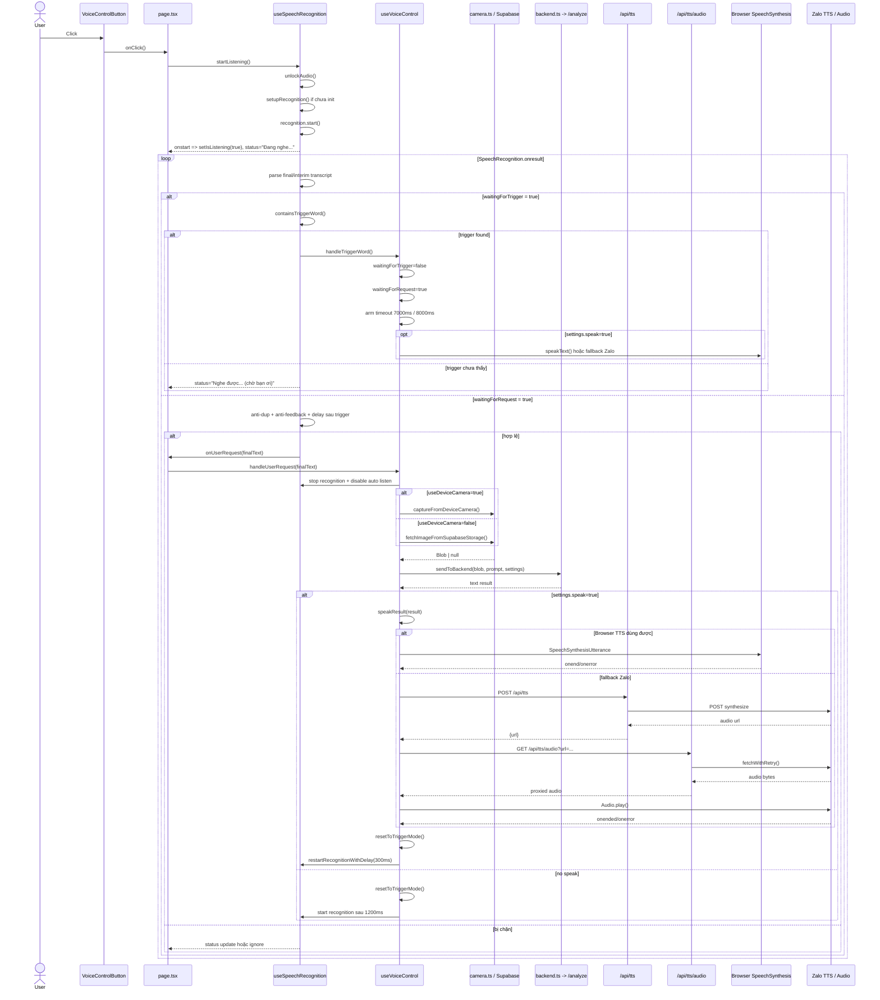

# Voice Pipeline Debug Flow cho `cam`

Tài liệu này mô tả luồng thực tế của app `cam` theo source hiện tại, với mục tiêu:

- Lần được end-to-end flow từ lúc bấm nút đến lúc TTS đọc xong.
- Biết hàm nào chạy trước/sau, state/ref nào điều khiển nhánh.
- Biết request nào được gửi đi, dữ liệu nào được truyền vào.
- Biết khi flow hỏng ở bước nào thì nên nhìn log nào, file nào, biến nào.

Phạm vi tài liệu:

- UI entrypoint: `src/app/page.tsx`
- STT / trigger / request capture: `src/hooks/useSpeechRecognition.ts`
- Điều phối xử lý request: `src/hooks/useVoiceControl.ts`
- TTS / anti-feedback / restart: `src/utils/speech.ts`
- Backend call: `src/utils/backend.ts`
- Camera / Supabase image: `src/utils/camera.ts`
- Next API routes:
  - `src/app/api/tts/route.ts`
  - `src/app/api/tts/audio/route.ts`

## 1. Kiến trúc tổng quan

Luồng chính hiện tại:

1. User bấm `VoiceControlButton`.
2. `page.tsx` gọi `startListening()` từ `useSpeechRecognition`.
3. `useSpeechRecognition` khởi tạo `SpeechRecognition`, đăng ký `onstart`, `onend`, `onerror`, `onresult`.
4. STT nghe liên tục cho đến khi gặp trigger word như `bạn ơi`.
5. Khi gặp trigger word, `useVoiceControl.handleTriggerWord()` chuyển app từ `waitingForTrigger` sang `waitingForRequest`.
6. User nói yêu cầu.
7. `useSpeechRecognition.onresult` gom transcript final, kiểm tra anti-duplicate, anti-feedback, chống gửi quá sớm sau trigger, rồi gọi `onUserRequest`.
8. `page.tsx` set `currentRequest`, sau đó gọi `useVoiceControl.handleUserRequest(promptText)`.
9. `useVoiceControl` tạm dừng recognition, lấy ảnh từ camera thiết bị hoặc Supabase, rồi gọi backend `/analyze`.
10. Khi backend trả text, nếu `settings.speak = true` thì gọi `speakResult()`.
11. `speakResult()` chọn nhánh Browser TTS hoặc Zalo TTS, phát audio, ghi `lastTTSEndTimeRef`.
12. Sau khi TTS kết thúc, app reset về trạng thái chờ trigger và bật recognition lại.

## 2. Sequence Diagram



## 3. Flow chi tiết theo phase

### Phase A. Mount app và khởi tạo UI

File: `src/app/page.tsx`

State chính của page:

- `isListening`
- `status`
- `settingsOpen`
- `imageUrl`
- `imageLoading`
- `imageError`

Ref chính ở page:

- `recognitionRef`
- `shouldAutoListenRef`
- `isProcessingRef`
- `waitingForTriggerRef`
- `lastTTSEndTimeRef`
- `restartListeningRef`

Lưu ý quan trọng:

- `page.tsx` tự tạo `recognitionRef`.
- `useSpeechRecognition.ts` cũng tự tạo một `recognitionRef` riêng bên trong hook.
- `useVoiceControl.ts` đang nhận `recognitionRef` từ `page.tsx`, không phải ref nội bộ của `useSpeechRecognition`.
- Đây là một điểm nghi ngờ lớn vì nơi `start()/onresult` và nơi `stop()/restart()` có thể đang thao tác trên hai instance khác nhau.

Khi mount:

- `useSettings()` load config từ:
  1. Supabase
  2. localStorage
  3. default settings
- `useEffect()` trong `page.tsx` set welcome notification sau `500ms`.

Log/status kỳ vọng:

- Overlay `Đang tải cấu hình...` nếu `loaded=false`
- Sau `500ms` có notification welcome

### Phase B. User bấm nút để bắt đầu nghe

Nút:

- `VoiceControlButton`
- `onClick={() => isListening ? stopListening() : startListening()}`

Hàm vào:

- `useSpeechRecognition.startListening()`

Việc `startListening()` làm:

1. Gọi `unlockAudio()`
2. Nếu chưa có recognition instance thì gọi `setupRecognition()`
3. Set `shouldAutoListenRef.current = true`
4. Reset `lastFinalNormalizedRef.current = ''`
5. Gọi `safeStartRecognition()`

`setupRecognition()` cấu hình:

- Kiểm tra secure context:
  - phải là HTTPS
  - hoặc `localhost`
  - hoặc `127.0.0.*`
- Lấy constructor:
  - `window.SpeechRecognition`
  - hoặc `window.webkitSpeechRecognition`
- Set:
  - `lang = 'vi-VN'`
  - `continuous = true`
  - `interimResults = true`
  - `maxAlternatives = 1`

Event handlers được đăng ký:

- `onaudiostart`
- `onsoundstart`
- `onspeechstart`
- `onstart`
- `onend`
- `onerror`
- `onresult`

Log kỳ vọng:

- `Speech recognition started`
- `Audio Context started`
- `Sound detected`
- `Speech detected`

Status kỳ vọng:

- `Đang nghe...`

### Phase C. Trigger mode: chờ từ khóa

Biến điều khiển:

- `waitingForTrigger = true`
- `waitingForRequest = false`

Luồng nằm trong `recognitionRef.current.onresult`.

Xử lý transcript:

1. Duyệt `event.results` từ `event.resultIndex`
2. Gom `finalTranscript`
3. Gom `interimTranscript`
4. `text = (finalTranscript || interimTranscript || '').trim()`

Chặn sớm:

- Nếu `!text` thì return
- Nếu `isProcessingRef.current` thì return
- Nếu `isSpeaking()` thì return

Khi `waitingForTriggerRef.current = true`:

1. Check trigger trên `interimTranscript` trước bằng `containsTriggerWord(interimNormalized)`
2. Nếu thấy trigger:
   - set `triggerWordDetectedTimeRef.current = Date.now()`
   - gọi `onTriggerWord()`
   - return
3. Nếu chưa thấy ở interim, check tiếp trên `finalTranscript`
4. Với final transcript:
   - normalize text
   - chống final lặp:
     - cùng transcript
     - trong vòng `< 1000ms`
   - nếu thấy trigger thì gọi `onTriggerWord()`
5. Nếu chưa thấy trigger:
   - update status `Nghe được: ... (chờ "bạn ơi!")`

Hàm kiểm tra trigger:

- `containsTriggerWord(text)`
- normalize bằng `normalizeVN()`
- match các biến thể:
  - `ban oi`
  - `ba oi`
  - `ba noi`
  - `bac oi`
  - `bang oi`
  - `ban noi`
  - `hey you`
  - `ban oi ban oi`

Log kỳ vọng:

- `containsTriggerWord check: { text, normalized, hasTrigger }`

### Phase D. Trigger word được nhận

Hàm:

- `useVoiceControl.handleTriggerWord()`

Việc hàm này làm:

1. `setWaitingForTrigger(false)`
2. `setWaitingForRequest(true)`
3. `setStatus('Hãy nói yêu cầu của bạn...')`
4. `showNotification('Đã nghe "bạn ơi!", hãy nói yêu cầu...')`
5. Clear timeout cũ nếu có
6. Arm timeout mới:
   - `7000ms` nếu `settings.speak = true`
   - `8000ms` nếu `settings.speak = false`
7. Nếu `settings.speak = true`, gọi `speakText()` để đọc prompt UX:
   - tiếng Việt: `Bạn cần giúp gì?`
   - tiếng Anh: `How can I help you?`

Nếu timeout hết hạn:

- quay về trigger mode
- status `Hãy nói "bạn ơi!" để bắt đầu...`
- notification timeout

Lưu ý:

- Request mode được bật ngay khi nhận trigger.
- `speakText()` chỉ là UX, không còn giữ vai trò “mở request mode” sau khi đọc xong.

### Phase E. Request mode: nhận câu yêu cầu

Điều kiện:

- `waitingForTrigger = false`
- `waitingForRequest = true`

Trong `useSpeechRecognition.onresult`, phần request mode chỉ xử lý khi có `finalText`.

Trước khi gửi request, có 4 lớp chặn:

1. Chống transcript final lặp trong `< 1000ms`
2. Anti-feedback sau TTS:
   - `if (now - lastTTSEndTimeRef.current < 1000) return;`
3. Chờ tối thiểu `800ms` sau trigger:
   - `if (timeSinceTrigger < 800) return;`
4. Chống gửi request dồn:
   - `if (now - lastCaptureTimeRef.current > 1500)`

Điều kiện gửi request:

- `finalText.split(/\s+/).length >= 2`
- vượt qua 4 lớp chặn bên trên

Khi hợp lệ:

1. `lastCaptureTimeRef.current = now`
2. `triggerWordDetectedTimeRef.current = 0`
3. Gọi `onUserRequest(finalText)`

Tại `page.tsx`, `onUserRequest` làm:

1. `setCurrentRequest(text)`
2. `handleUserRequest(text)`

Lưu ý:

- Code hiện tại không strip trigger word ra khỏi câu yêu cầu.
- Nếu user nói liền một câu kiểu `bạn ơi cho tôi hỏi...`, backend vẫn nhận nguyên câu đó.

### Phase F. Bắt đầu xử lý yêu cầu

Hàm:

- `useVoiceControl.handleUserRequest(promptText)`

Trình tự:

1. `clearRequestTimeout()`
2. `setIsProcessing(true)`
3. `setWaitingForRequest(false)`
4. `setStatus('Đang xử lý yêu cầu: ' + promptText)`
5. `showNotification('Đang xử lý yêu cầu...')`
6. Tắt auto listen:
   - `shouldAutoListenRef.current = false`
7. Tạm dừng recognition:
   - `stopRecognitionSafe()`

Sau đó lấy ảnh.

### Phase G. Lấy ảnh

Nhánh 1: `settings.useDeviceCamera = true`

Hàm:

- `captureFromDeviceCamera()`

Flow:

1. `navigator.mediaDevices.getUserMedia({ video: { facingMode: 'environment' } })`
2. Lấy video track đầu tiên
3. Nếu browser có `ImageCapture.takePhoto()` thì dùng trực tiếp
4. Nếu không có:
   - tạo `video`
   - gán `srcObject = stream`
   - chờ `onloadedmetadata`
   - `video.play()`
   - chờ `150ms`
   - draw ra `canvas`
   - `canvas.toDataURL('image/jpeg', 0.92)`
   - `fetch(dataUrl)` để đổi thành `Blob`
5. `finally`: stop toàn bộ track

Nhánh 2: `settings.useDeviceCamera = false`

Hàm:

- `fetchImageFromSupabaseStorage()`

Flow:

1. Gọi `fetchImageFromSupabase('cam', 'cam01/image.jpg')`
2. Trả `Blob | null`
3. Nếu lỗi thì throw message `Lỗi tải ảnh từ Supabase: ...`

### Phase H. Gọi backend `/analyze`

Hàm:

- `sendToBackend(blob, promptText, settings): Promise<string>`

Input:

- `blob: Blob | null`
- `promptText: string`
- `settings: Settings`

Xử lý dữ liệu gửi đi:

1. Check `settings.backendUrl.trim()`
2. Tạo `FormData`
3. Append `file`
   - nếu có ảnh:
     - tạo `File([blob], 'capture.jpg', { type: blob.type || 'image/jpeg' })`
   - nếu không có ảnh:
     - tạo empty file `empty.jpg`
4. Append:
   - `prompt`
   - `language`

Chuẩn hóa URL:

1. Lấy `settings.backendUrl.trim()`
2. Nếu không kết thúc bằng `/analyze` thì ép thêm `/analyze`
3. Validate bằng `new URL(apiUrl)`

Request thật:

- `fetch(apiUrl, { method: 'POST', body: formData, mode: 'cors' })`
- Không set `Content-Type`, để browser tự gắn boundary

Response handling:

- Nếu `!response.ok`:
  - đọc text
  - throw `HTTP {status}: {errorText}`
- Nếu `content-type` chứa `application/json`:
  - đọc `data`
  - ưu tiên `data.text`
  - xử lý các status:
    - `success`
    - `error`
    - `clarify`
- Nếu không phải JSON:
  - đọc text trực tiếp

Output:

- luôn trả `string` đã `trim()`

Network call quan sát được:

```text
POST {backendUrl}/analyze
Content-Type: multipart/form-data
FormData:
  file: capture.jpg | empty.jpg
  prompt: {promptText}
  language: vi | en
```

Log kỳ vọng:

- `=== BACKEND REQUEST DEBUG ===`
- `Sending to: ...`
- `Prompt text: ...`
- `FormData contents:`
- `Response status: ...`
- `Response headers: ...`
- `Response content-type: ...`
- `Response JSON data: ...` hoặc `Response text: ...`
- `Final result: ...`

### Phase I. Xử lý kết quả backend

Quay lại `handleUserRequest()`.

Nếu `result` rỗng:

- status lỗi
- notification lỗi
- `resetToTriggerMode()`
- return

Nếu có result:

1. `setStatus('Đã nhận kết quả')`
2. Nếu `settings.speak = true`:
   - gọi `speakResult(result, settings, onStart, onEnd, recognitionRef, shouldAutoListenRef, lastTTSEndTimeRef)`
3. Nếu `settings.speak = false`:
   - set status complete
   - `setTimeout(..., 1200)` để start recognition lại
   - `resetToTriggerMode()`

### Phase J. TTS: Browser hoặc Zalo

Các hàm chính:

- `speakText()`: đọc prompt UX sau trigger
- `speakResult()`: đọc kết quả backend
- `speakWithZaloTTS()`: nhánh Zalo
- `stopAllTTS()`: dừng mọi audio/TTS

#### J1. TTS queue / mutex

`speech.ts` có queue toàn cục:

- `let ttsQueue = Promise.resolve()`
- `enqueueTTS(fn)` đảm bảo các lần gọi TTS chạy tuần tự

Ý nghĩa:

- tránh chồng nhiều lần `speechSynthesis`
- tránh phát nhiều audio Zalo cùng lúc

#### J2. Các bước chung của `speakText()` và `speakResult()`

Trình tự chung:

1. `enqueueTTS(...)`
2. `stopRecognition(recognitionRef)`
3. `shouldAutoListenRef.current = false`
4. tạo `markEnd()` để ghi:
   - `lastTTSEndTimeRef.current = Date.now()`
5. `stopAllTTS()`
6. map ngôn ngữ:
   - `vi -> vi-VN`
   - `en -> en-US`
7. quyết định có fallback sang Zalo không
8. phát audio
9. `markEnd()`
10. `onEnd?.()`
11. `finally`: `restartRecognitionWithDelay(..., 300)`

#### J3. Quyết định Browser hay Zalo

Logic hiện tại:

- `shouldUseZaloFallback(ttsLanguage)`
- chỉ xét fallback nếu ngôn ngữ là `vi-VN`
- nếu browser không có voice tiếng Việt thì dùng Zalo
- nếu `speechSynthesis.getVoices()` rỗng thì coi như không có voice và dùng Zalo luôn

Lưu ý:

- `settings.ttsProvider` tồn tại trong UI/settings nhưng không phải công tắc quyết định duy nhất của runtime hiện tại.
- Nhánh runtime đang thiên về auto fallback hơn là bám cứng `ttsProvider`.

#### J4. Browser TTS

Flow:

1. `waitVoicesReady(600)`
2. Tạo `SpeechSynthesisUtterance(text)`
3. Set:
   - `utterance.lang`
   - `utterance.rate = settings.voiceRate`
   - `utterance.volume = settings.voiceVolume`
4. Tìm `voice` phù hợp theo `lang`
5. Nếu muốn đọc `vi-VN` mà không pick được voice:
   - log skip
   - `return`
6. Gọi `speechSynthesis.speak(utterance)`
7. Chờ `onend` hoặc `onerror`

Log kỳ vọng:

- `Speech synthesis started`
- `Speech synthesis ended`
- hoặc `Speech synthesis error: ...`

#### J5. Zalo TTS

Flow client:

1. `fetch('/api/tts', { method: 'POST', body: JSON.stringify(...) })`
2. body gồm:
   - `text`
   - `speaker_id`
   - `speed`
   - `encode_type`
3. response `{ url }`
4. Tạo `proxied = /api/tts/audio?url=...`
5. `const audio = new Audio(proxied)`
6. set `audio.volume`
7. `audio.play()`
8. chờ `audio.onended` hoặc `audio.onerror`

Request body `/api/tts`:

```json
{
  "text": "nội dung cần đọc",
  "speaker_id": 1,
  "speed": 1.0,
  "encode_type": 1
}
```

### Phase K. Next API `/api/tts`

File:

- `src/app/api/tts/route.ts`

Input body:

- `text?: string`
- `speed?: number`
- `speaker_id?: number`
- `encode_type?: number`
- `quality?: number`

Validation:

- phải có ít nhất 1 API key:
  - `ZALO_AI_TTS_APIKEY1`
  - `ZALO_AI_TTS_APIKEY2`
  - `ZALO_AI_TTS_APIKEY3`
  - fallback: `ZALO_AI_TTS_APIKEY`
- `text` không được rỗng
- `text.length <= 2000`
- `speed` bị clamp về `0.8..1.2`

Flow:

1. Tạo `URLSearchParams`
2. POST tới `https://api.zalo.ai/v1/tts/synthesize`
3. Thử từng API key cho đến khi thành công
4. Nếu key fail do quota hoặc invalid:
   - tiếp tục thử key kế tiếp
5. Nếu thành công:
   - trả `{ url: data.data.url }`

Log kỳ vọng:

- `[TTS] Success với API key ...`
- `[TTS] Key X failed: ...`
- `[TTS] Key X request failed: ...`
- `[TTS] Tất cả API keys đều failed`

### Phase L. Next API `/api/tts/audio`

File:

- `src/app/api/tts/audio/route.ts`

Input:

- query param `url`

Validation:

- `url` phải parse được
- host phải là `*.zalo.ai` hoặc `zalo.ai`

Flow:

1. Gọi `fetchWithRetry(url, 8)`
2. Mỗi lần fetch:
   - method `GET`
   - `redirect: 'follow'`
   - headers:
     - `User-Agent`
     - `Accept: */*`
     - `Accept-Encoding: identity`
     - `Range: bytes=0-`
3. Nếu `200` hoặc `206` thì thành công
4. Nếu `404`:
   - chờ rồi retry
   - backoff: `150 + i*120ms`
5. Nếu lỗi khác:
   - break sớm
6. Nếu thành công:
   - đọc `arrayBuffer()`
   - trả về `Response` với `Content-Type` upstream

Log kỳ vọng:

- `[tts/audio] upstream { status, ct, len }`

## 4. Call Tree chi tiết

```text
page.tsx
  -> useSettings()
  -> useNotification()
  -> useVoiceControl(...)
       -> handleTriggerWord()
          -> speakText() [optional]
       -> handleUserRequest(promptText)
          -> captureFromDeviceCamera() | fetchImageFromSupabaseStorage()
          -> sendToBackend(blob, promptText, settings)
          -> speakResult(result) [optional]
  -> useSpeechRecognition(...)
       -> startListening()
          -> unlockAudio()
          -> setupRecognition()
             -> SpeechRecognition.onstart
             -> SpeechRecognition.onend
             -> SpeechRecognition.onerror
             -> SpeechRecognition.onresult
                -> containsTriggerWord()
                -> onTriggerWord()
                -> onUserRequest(finalText)
```

## 5. Timeline / timing đang có trong code

| Mốc | Giá trị | Nơi dùng | Ý nghĩa debug |
|---|---:|---|---|
| Welcome notification | `500ms` | `page.tsx` | Toast chào khi app mount |
| Auto restart sau `onend` | `500ms` | `useSpeechRecognition.ts` | Recognition tự start lại sau khi end nếu đang auto listen |
| Delay sau trigger trước khi gửi request | `800ms` | `useSpeechRecognition.ts` | Tránh ăn luôn cùng một câu với trigger |
| Anti-feedback sau TTS | `1000ms` | `useSpeechRecognition.ts` | Tránh STT bắt lại giọng TTS ngay lập tức |
| Chống final transcript lặp | `1000ms` | `useSpeechRecognition.ts` | Chặn duplicate transcript gần nhau |
| Chống gửi request dồn | `1500ms` | `useSpeechRecognition.ts` | Không gửi hai request liên tiếp quá nhanh |
| Restart sau TTS | `300ms` | `speech.ts` | Bật recognition lại sau khi TTS xong |
| Restart sau xử lý khi `speak=false` | `1200ms` | `useVoiceControl.ts` | Start lại recognition thủ công |
| Restart sau error khi `speak=false` | `1000ms` | `useVoiceControl.ts` | Retry nghe sau lỗi |
| Timeout chờ request khi `speak=true` | `7000ms` | `useVoiceControl.ts` | Hết thời gian nói yêu cầu |
| Timeout chờ request khi `speak=false` | `8000ms` | `useVoiceControl.ts` | Hết thời gian nói yêu cầu |
| `waitVoicesReady()` | `600ms` | `speech.ts` | Chờ browser load voice |
| Retry upstream audio | `8 lần` | `/api/tts/audio` | Chờ file audio sẵn sàng |
| Backoff audio retry | `150 + i*120ms` | `/api/tts/audio` | Tăng dần khi 404 |
| Camera fallback settle | `150ms` | `camera.ts` | Chờ video ổn định trước khi draw canvas |
| Auto close notification | `3000ms` | `useNotification.ts` | Toast biến mất sau 3s |

## 6. Settings và tham số quan trọng

### Settings

`useSettings.ts` đang quản lý:

- `backendUrl`
- `useDeviceCamera`
- `speak`
- `voiceRate`
- `voiceVolume`
- `language`
- `ttsProvider`
- `zaloSpeakerId`
- `zaloSpeed`
- `zaloEncodeType`

Default hiện tại:

```ts
{
  backendUrl: 'http://localhost:5000/analyze',
  useDeviceCamera: true,
  speak: true,
  voiceRate: 1,
  voiceVolume: 1,
  language: 'vi',
  ttsProvider: 'browser',
  zaloSpeakerId: 1,
  zaloSpeed: 1.0,
  zaloEncodeType: 1
}
```

### Refs/state điều phối flow

`page.tsx`:

- `recognitionRef`
- `shouldAutoListenRef`
- `isProcessingRef`
- `waitingForTriggerRef`
- `lastTTSEndTimeRef`
- `restartListeningRef`

`useSpeechRecognition.ts`:

- `recognitionRef`
- `shouldAutoListenRef`
- `lastCaptureTimeRef`
- `waitingForTriggerRef`
- `waitingForRequestRef`
- `isProcessingRef`
- `lastFinalNormalizedRef`
- `lastFinalTimeRef`
- `triggerWordDetectedTimeRef`

Ý nghĩa:

- `lastTTSEndTimeRef`: mốc kết thúc TTS để anti-feedback
- `triggerWordDetectedTimeRef`: mốc phát hiện trigger để delay `800ms`
- `lastCaptureTimeRef`: chống gửi request liên tiếp
- `lastFinalNormalizedRef` + `lastFinalTimeRef`: chống transcript final bị bắn lặp
- `shouldAutoListenRef`: cho phép recognition tự bật lại hay không

## 7. Network calls cần theo dõi

### 7.1 Frontend -> backend analyze

```text
POST {backendUrl}/analyze
multipart/form-data
  file
  prompt
  language
```

Ví dụ shape:

```text
file=capture.jpg
prompt=Bạn ơi cho tôi biết trong ảnh có gì
language=vi
```

### 7.2 Frontend -> Next TTS route

```text
POST /api/tts
Content-Type: application/json
```

Body:

```json
{
  "text": "kết quả cần đọc",
  "speaker_id": 1,
  "speed": 1,
  "encode_type": 1
}
```

### 7.3 Frontend audio -> proxy route

```text
GET /api/tts/audio?url={zalo_audio_url}
```

### 7.4 Next route -> Zalo

```text
POST https://api.zalo.ai/v1/tts/synthesize
Content-Type: application/x-www-form-urlencoded
Headers:
  apikey: {apiKey}
Body:
  input={text}
  speed={speed}
  speaker_id={speaker_id}
  encode_type={encode_type}
```

## 8. Observable behavior / interface hiện có

Các shape/hàm public cần hiểu khi debug:

### `sendToBackend(blob, promptText, settings) -> Promise<string>`

- Input:
  - `Blob | null`
  - `promptText: string`
  - `settings: Settings`
- Output:
  - `string` kết quả backend

### `handleUserRequest(promptText) -> Promise<void>`

- Nhận transcript cuối cùng
- Tắt recognition
- Lấy ảnh
- Gọi backend
- Đọc TTS nếu cần
- Reset state về trigger mode

### `speakText(...)`

- Dùng sau khi nhận trigger word
- Đọc prompt UX như `Bạn cần giúp gì?`

### `speakResult(...)`

- Dùng sau khi backend trả kết quả
- Đọc nội dung phản hồi

### `POST /api/tts`

Body:

- `text`
- `speaker_id`
- `speed`
- `encode_type`

### Backend `/analyze`

FormData:

- `file`
- `prompt`
- `language`

## 9. Checklist debug theo điểm đứt flow

### Case 1. Bấm nút nhưng không start mic

Kiểm tra:

- Browser có hỗ trợ `SpeechRecognition` / `webkitSpeechRecognition` không
- Trang có chạy bằng HTTPS hoặc localhost không
- `startListening()` có được gọi không
- Console có `Speech recognition started` không
- `status` có đổi sang `Đang nghe...` không

Nhìn file:

- `src/app/page.tsx`
- `src/hooks/useSpeechRecognition.ts`

### Case 2. Start mic rồi nhưng không bắt được trigger word

Kiểm tra:

- `onresult` có bắn không
- Console có `containsTriggerWord check` không
- Transcript đang ra `interim` hay `final`
- Từ user nói có normalize về được các biến thể trong list trigger không
- `isProcessingRef.current` hoặc `isSpeaking()` có đang chặn sớm không

Nhìn file:

- `src/hooks/useSpeechRecognition.ts`
- `src/utils/speech.ts`

### Case 3. Nhận trigger rồi nhưng không vào request mode

Kiểm tra:

- `handleTriggerWord()` có được gọi không
- `waitingForTrigger` có chuyển `false` không
- `waitingForRequest` có chuyển `true` không
- Có timeout cũ nào đang làm reset sớm không
- Nếu `settings.speak=true`, `speakText()` có đang chặn hoặc làm perception sai không

Nhìn file:

- `src/hooks/useVoiceControl.ts`
- `src/utils/speech.ts`

### Case 4. Có transcript nhưng không gửi backend

Kiểm tra:

- Có phải transcript vừa đến trong vòng `< 800ms` sau trigger không
- Có phải vừa TTS xong trong vòng `< 1000ms` không
- Có bị duplicate final trong `< 1000ms` không
- Có bị chặn bởi `lastCaptureTimeRef` trong `< 1500ms` không
- Câu nói có ít nhất `2 từ` không
- `onUserRequest(finalText)` có được gọi chưa

Nhìn log:

- status `Nghe được: ... (đang chờ...)`
- log duplicate hoặc không có log backend request

Nhìn file:

- `src/hooks/useSpeechRecognition.ts`
- `src/hooks/useVoiceControl.ts`

### Case 5. Gọi backend rồi nhưng không có kết quả

Kiểm tra:

- URL cuối cùng sau khi bị ép `/analyze`
- `backendUrl` có hợp lệ không
- `FormData` có đủ `file`, `prompt`, `language` không
- CORS/network error
- Backend có trả JSON đúng shape không
- `data.text` có tồn tại không

Nhìn log:

- `=== BACKEND REQUEST DEBUG ===`
- `Response status`
- `Response JSON data`
- `Response text`

Nhìn file:

- `src/utils/backend.ts`

### Case 6. Backend trả kết quả nhưng không đọc TTS

Kiểm tra:

- `settings.speak` có bật không
- `speakResult()` có được gọi không
- Browser có `speechSynthesis` không
- Browser có voice `vi-VN` không
- Nếu không có voice vi, nhánh Zalo có chạy không
- `/api/tts` có trả `url` không
- `/api/tts/audio` có fetch upstream thành công không

Nhìn log:

- `=== SPEAK RESULT DEBUG ===`
- `Using Zalo TTS fallback...`
- `Speech synthesis ended`
- `[tts/audio] upstream ...`

Nhìn file:

- `src/utils/speech.ts`
- `src/app/api/tts/route.ts`
- `src/app/api/tts/audio/route.ts`

### Case 7. TTS đọc xong nhưng không quay lại nghe

Kiểm tra:

- `restartRecognitionWithDelay(..., 300)` có được gọi không
- `shouldAutoListenRef.current` có bị set `false` lại ở đâu không
- `recognitionRef.current.start()` có throw không
- Có bị lệch ref giữa page và `useSpeechRecognition` không
- Recognition có start lại nhưng request mới bị anti-feedback `1000ms` chặn không

Nhìn log:

- `Restarting speech recognition after TTS...`
- `Speech recognition restarted after TTS`
- `Failed to restart speech recognition: ...`

### Case 8. Zalo có URL nhưng audio không phát

Kiểm tra:

- `/api/tts/audio` có trả `200/206` không
- upstream Zalo có đang `404` tạm thời không
- `audio.onerror` có bắn không
- Browser autoplay/audio policy
- `unlockAudio()` đã được gọi từ interaction trước đó chưa

Nhìn log:

- `[tts/audio] upstream { status, ct, len }`
- `Audio error event: ...`

## 10. Điểm nghi ngờ gây lỗi flow hiện tại

Đây là các điểm đáng kiểm tra đầu tiên nếu flow đang “lúc được lúc không”.

### 10.1 `recognitionRef` bị tách đôi giữa page và hook

Hiện tại:

- `page.tsx` có `const recognitionRef = useRef(...)`
- `useSpeechRecognition.ts` cũng có `const recognitionRef = useRef(...)`

Trong khi đó:

- `useVoiceControl` đang dùng ref từ `page.tsx`
- `useSpeechRecognition` lại start/onresult trên ref nội bộ của hook

Rủi ro:

- nơi stop/start/restart không thao tác trên cùng instance recognition
- `speech.ts` có thể đang stop một ref rỗng trong khi STT thật đang chạy ở ref khác

### 10.2 `restartListeningRef` ở page chưa được gán

Trong `page.tsx` có:

- `const restartListeningRef = useRef<(() => void) | null>(null);`
- `handleRestartListening()` gọi `restartListeningRef.current?.()`

Nhưng dòng gán thực tế đang bị comment:

- `// restartListeningRef.current = restartListening;`

Rủi ro:

- callback restart từ ngoài hiện tại không có tác dụng

### 10.3 Restart STT sau `300ms` nhưng anti-feedback chặn `1000ms`

Hiện tại:

- `speech.ts` restart recognition sau `300ms`
- `useSpeechRecognition` bỏ qua request nếu `now - lastTTSEndTimeRef.current < 1000`

Rủi ro:

- nhìn bề ngoài thì app đã nghe lại
- nhưng trong khoảng gần `700ms` đầu sau restart, request mới có thể bị ignore
- cảm giác với user là “đã restart rồi mà không nhận lệnh”

### 10.4 `ttsProvider` không phải công tắc runtime thực sự

UI/settings có `ttsProvider`, nhưng runtime đang quyết định theo:

- nếu là `vi-VN` và browser không có voice vi thì fallback Zalo
- nếu browser có voice vi thì dùng browser

Rủi ro:

- user chọn Zalo nhưng app vẫn có thể đi browser
- hoặc user nghĩ đang bám setting nhưng thực tế code đang auto fallback

### 10.5 Browser TTS có thể `return` sớm mà không phát tiếng

Nhánh browser TTS có đoạn:

- nếu `utterance.lang === 'vi-VN'` và không pick được voice thì `return`

Rủi ro:

- flow vẫn tiếp tục `finally`
- recognition vẫn restart
- nhưng user không nghe thấy gì, tưởng backend/TTS lỗi

### 10.6 `sendToBackend` luôn ép URL về `/analyze`

Logic hiện tại:

- nếu URL không kết thúc bằng `/analyze` thì tự append `/analyze`

Rủi ro:

- nếu user nhập một endpoint khác đã đúng rồi, app vẫn đổi URL
- debug network sẽ bị lệch với kỳ vọng người cấu hình

### 10.7 Trigger check cả interim và final

Trigger được check ở cả:

- `interimTranscript`
- `finalTranscript`

Rủi ro:

- transcript interim nhận sai gần giống `bạn ơi` có thể mở request mode sớm
- nhất là trong môi trường ồn hoặc phát âm gần giống

## 11. Test scenarios nên chạy khi debug

### Scenario A. Happy path đầy đủ

1. Bấm nút
2. Nói `bạn ơi`
3. Nghe prompt `Bạn cần giúp gì?`
4. Nói yêu cầu có ít nhất 2 từ
5. App lấy ảnh
6. App gọi backend
7. App đọc kết quả
8. App quay về chờ trigger

### Scenario B. Không có trigger

1. Bấm nút
2. Nói câu bất kỳ không chứa trigger
3. Xem status có update `Nghe được... (chờ bạn ơi)` không

### Scenario C. Trigger xong im lặng

1. Nói `bạn ơi`
2. Không nói tiếp
3. Chờ `7000ms` hoặc `8000ms`
4. App có reset về trigger mode không

### Scenario D. Có trigger và request rất sát nhau

1. Nói liền một câu kiểu `bạn ơi cho tôi biết...`
2. Kiểm tra có bị chặn bởi delay `800ms` không

### Scenario E. Backend lỗi / không kết nối

1. Đặt backend sai URL
2. Gửi request
3. Quan sát error path, notification, status và khả năng quay về trigger mode

### Scenario F. Browser không có `vi-VN`

1. Dùng máy/browser không có voice tiếng Việt
2. Kiểm tra app có fallback sang Zalo không

### Scenario G. Zalo trả URL nhưng upstream audio chưa sẵn sàng

1. Theo dõi `/api/tts/audio`
2. Xem retry `404 -> retry` có xảy ra không

### Scenario H. TTS xong rồi nói lại ngay

1. Cho app đọc xong
2. Nói lại ngay trong khoảng `< 1s`
3. Kiểm tra anti-feedback có bỏ qua không

## 12. Gợi ý trace nhanh khi debug live

Nếu cần trace nhanh ngoài hiện trường, đi theo thứ tự này:

1. Có `Speech recognition started` chưa
2. Có `containsTriggerWord check` chưa
3. Có `handleTriggerWord()` chưa
4. Có `onUserRequest(finalText)` chưa
5. Có `=== BACKEND REQUEST DEBUG ===` chưa
6. Có `Final result:` chưa
7. Có `=== SPEAK RESULT DEBUG ===` chưa
8. Có `Speech synthesis ended` hoặc `Zalo TTS ended` chưa
9. Có `Restarting speech recognition after TTS...` chưa

Nếu bị đứt ở bước nào, khoanh vùng theo file của bước đó trước thay vì đọc cả hệ thống.
